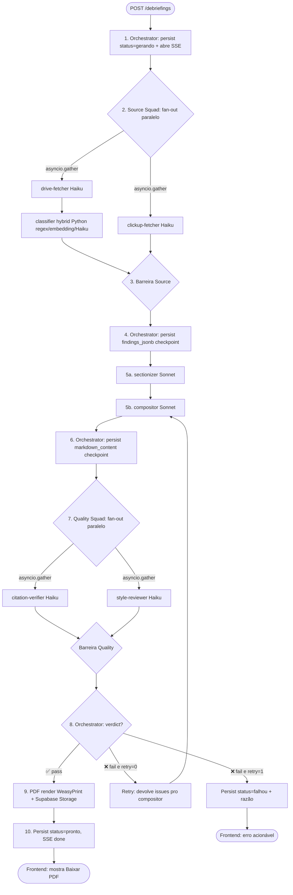

# Workflow — FLG Debriefings

> Fluxograma completo com 7 fases, condicionais formalizados, barreiras de sincronização, e o que cada componente entrega ao próximo. Reflete a arquitetura squad de 7+1 componentes ([`README.md`](README.md), [`ARCHITECTURE.md`](ARCHITECTURE.md)).

---

## 🗺️ Visão de alto nível



---

## 📋 Tabela de fases

| # | Fase | Componente | Tipo | I/O |
|---|---|---|---|---|
| 1 | **Init** | Orchestrator | Python | In: request payload · Out: debriefing_id + SSE stream aberto |
| 2a | **Fetch Drive** | drive-fetcher | LLM Haiku | In: folder_id, cliente_nome, período · Out: list of raw Drive items + content excerpts |
| 2b | **Fetch ClickUp** | clickup-fetcher | LLM Haiku | In: list_id, período · Out: list of tasks + comments + milestones |
| 2c | **Classify Drive items** | classifier | Hybrid Python | In: Drive items raw · Out: items classified (transcricao/relatorio/PE/outro) com key points |
| 3 | **Source barrier** | Orchestrator | Python | Aguarda gather(drive-fetcher → classifier, clickup-fetcher) |
| 4 | **Checkpoint 1** | Orchestrator | Python | In: findings A+B · Out: `findings_jsonb` persistido no DB |
| 5a | **Section outline** | sectionizer | LLM Sonnet | In: findings consolidados · Out: outline com 11 seções FLG + bullets prioritários por seção |
| 5b | **Compose prose** | compositor | LLM Sonnet | In: outline + findings · Out: Markdown completo (~20 páginas) |
| 6 | **Checkpoint 2** | Orchestrator | Python | In: markdown · Out: `markdown_content` persistido |
| 7a | **Verify citations** | citation-verifier | LLM Haiku | In: markdown + findings · Out: `CitationVerdict{pass, issues, score}` |
| 7b | **Review style** | style-reviewer | LLM Haiku | In: markdown · Out: `StyleVerdict{pass, issues, score}` |
| 7c | **Quality barrier** | Orchestrator | Python | Aguarda gather(citation-verifier, style-reviewer), consolida `QualityVerdict` |
| 8 | **Decision** | Orchestrator | Python | Decide: accept / retry / abort baseado em `verdict.pass` + `retry_count` |
| 9 | **PDF render** | Orchestrator | Python (WeasyPrint) | In: markdown · Out: PDF binário em Supabase Storage |
| 10 | **Done** | Orchestrator | Python | In: storage path · Out: SSE done + row final com `status='pronto'` |

---

## 🚦 Condicionais formalizadas

### C-1 — Source Squad: degradação graceful em fonte indisponível

Orchestrator aguarda `gather(drive_task → classifier, clickup_task)`. Comportamento por estado:

| ClickUp | Drive | Classifier | Ação |
|---|---|---|---|
| ✅ ok | ✅ ok | ✅ ok | Prossegue normal |
| ✅ ok | ❌ erro/timeout | skip | Continua com nota `[Drive indisponível]` no findings — sectionizer adapta |
| ❌ erro/timeout | ✅ ok | ✅ ok | Continua com nota `[ClickUp indisponível]` |
| ✅ ok | ✅ ok | ❌ erro | Items do Drive ficam `type=desconhecido`, ainda incluídos no findings |
| ❌ erro/timeout | ❌ erro/timeout | — | **Aborta** — `status=falhou` com razão "Nenhuma fonte disponível" |

Justificativa: 1 fonte indisponível não trava o pipeline inteiro. Tudo-ou-nada é frágil.

---

### C-2 — Classifier: hybrid 3-layer routing

**Implementado em `backend/agents/debriefings/squads/source/classifier.py` (Python puro com fallback Haiku).**

```
Pra cada doc do Drive retornado pelo drive-fetcher:

  CAMADA 1: Regex no nome do arquivo
    - "transcrição|transcricao|transcript" → type=transcricao (confidence=high)
    - "relatório.*entrega|relatorio.*entrega|entregas?" → type=relatorio_entregas
    - "planejamento.*estratégico|PE\b|manifesto" → type=documento_estrategico
    - Outro → cai pra camada 2

  CAMADA 2: Embedding similarity (Cohere/OpenAI small embedding, $0.0001/req)
    - Calcula embedding do nome+primeiros 500 chars do conteúdo
    - Compara com centroids pré-treinados de cada categoria
    - Se max(similarity) >= 0.75 → type da categoria mais próxima (confidence=medium)
    - Senão → cai pra camada 3

  CAMADA 3: LLM Haiku fallback (~5% dos casos)
    - Chama Haiku 4.5 com prompt curto + primeiros 500 chars
    - Classifica em uma das 4 categorias
    - Confidence=fuzzy
```

**Custo por doc:**
- Camada 1 (~70%): $0
- Camada 2 (~25%): $0,0001
- Camada 3 (~5%): $0,001

**Latência:**
- Camada 1: <1ms
- Camada 2: 50-200ms
- Camada 3: 500-1500ms

Detalhes completos em [`squads/source-squad/classifier.agent.md`](squads/source-squad/classifier.agent.md).

---

### C-3 — Compositor retry com issues do Quality Squad

Quando Orchestrator decide chamar compositor de novo (`retry_count=1`):

```python
# Inputs do retry incluem:
{
    "outline": outline_da_run_anterior,
    "findings": findings_originais,
    "previous_markdown": markdown_da_run_anterior,
    "quality_issues": [
        {"severity": "high", "section": "7.3", "agent": "citation-verifier",
         "issue": "Bullet sobre 'aumento de 40% no engagement' não tem citation_uri"},
        {"severity": "medium", "section": "10.1", "agent": "style-reviewer",
         "issue": "Uso de 'eu acho' — preferir 'a FLG percebe'"},
    ]
}
```

Compositor recebe instrução explícita no prompt: "corrija APENAS os issues listados, mantenha o restante do conteúdo idêntico ao previous_markdown". Output substitui o Markdown anterior (sem merge).

Após retry, Orchestrator **re-roda Quality Squad inteiro** (citation + style em paralelo). Se ainda falhar, `status='falhou'` sem 2º retry.

---

### C-4 — Quality Squad: critérios de pass/fail

**citation-verifier** (`squads/quality-squad/citation-verifier.agent.md`):

| Check | Threshold | Severidade |
|---|---|---|
| Cada bullet factual tem `[fonte: ...]` ou `citation_uri` inline | ≥80% dos bullets factuais | 🔴 fail se <80% |
| Sample N=10 claims, valida contra findings | 0 invenções | 🔴 fail se ≥1 invenção |
| Números (%, R$, datas) batem com findings | 100% | 🔴 fail se qualquer divergente |

**style-reviewer** (`squads/quality-squad/style-reviewer.agent.md`):

| Check | Threshold | Severidade |
|---|---|---|
| Sem gírias ("tá", "pra", "num") | 0 ocorrências | 🟡 warning |
| Sem "como AI eu...", "como modelo de linguagem..." | 0 ocorrências | 🔴 fail se houver |
| Primeira pessoa do plural ("nós da FLG observamos") | preferencial | 🟡 warning se 1ª pessoa singular |
| Tom corporativo (sem coloquial excessivo) | qualitativo | 🟡 warning |

**Verdict consolidado pelo Orchestrator:**

```python
verdict.pass = (
    citation_verdict.pass AND
    style_verdict.pass AND
    citation_verdict.score >= 80 AND
    style_verdict.score >= 70
)
```

---

### C-5 — Cost guard (atravessa todas as fases)

Orchestrator monitora `state.accumulated_cost_usd` após cada agente. Se ultrapassa `$5` (~R$28):

- Aborta pipeline imediato
- Persist `status=falhou`, `erro="cost cap exceeded at phase X, accumulated=$X.XX"`
- SSE emite `error` com razão pro frontend

Detalhes em [`protocols/routing-rules.md`](protocols/routing-rules.md).

---

## ⏱️ SLAs por fase

| Fase | Timeout (soft) | Timeout (hard) | Ação no soft | Ação no hard |
|---|---|---|---|---|
| drive-fetcher | 30s | 60s | Log warning | Aborta com erro acionável |
| clickup-fetcher | 30s | 60s | Log warning | Aborta com erro acionável |
| classifier | 10s | 30s | Log warning | Items ficam `type=desconhecido`, prossegue |
| sectionizer | 30s | 60s | Log warning | Aborta com erro |
| compositor | 60s | 120s | Log warning | Aborta com erro |
| citation-verifier | 30s | 60s | Log warning | Verdict=warning (não bloqueia PDF) |
| style-reviewer | 20s | 45s | Log warning | Verdict=warning |
| PDF render | 15s | 30s | Log warning | Aborta — markdown sem PDF |
| **Total esperado** | **75-120s** | **240s** | — | — |

Total esperado em 75-120s graças ao paralelismo Source Squad + Quality Squad. Hard cap total do Orchestrator: 4min.

---

## 📡 Eventos SSE pro frontend

Orchestrator emite eventos no stream `GET /debriefings/:id/stream`. Tipos:

| Tipo | Quando | Payload |
|---|---|---|
| `phase_start` | Início de cada fase | `{phase, name, agents: [...]}` |
| `agent_start` | Início de cada agente LLM | `{agent, model}` |
| `agent_progress` | Progresso intra-agente (compositor escrevendo) | `{agent, chars, tokens_so_far}` |
| `agent_done` | Fim de cada agente | `{agent, tokens_in, tokens_out, cost, duration_ms}` |
| `phase_done` | Fim de cada fase | `{phase, accumulated_cost}` |
| `retry` | Retry disparado | `{retry_count, reason, issues_to_fix}` |
| `error` | Erro fatal | `{phase, agent, reason}` |
| `done` | Pipeline completo | `{status, pdf_storage_path, total_cost, total_duration}` |

Frontend StreamPanel ([Phase 5](../../superpowers/HANDOFF-debriefings.md#estado-atual-em-produção)) atualiza UI conforme eventos chegam.

---

## 🌀 Estado em cada momento (persistência)

| Momento | `status` | `findings_jsonb` | `markdown_content` | `pdf_storage_path` |
|---|---|---|---|---|
| POST recebido | `gerando` | null | null | null |
| Source Squad terminou (barrier) | `gerando` | preenchido | null | null |
| Compositor terminou | `gerando` | preenchido | preenchido | null |
| Quality Squad pass + PDF | `pronto` | preenchido | final | preenchido |
| Erro fatal | `falhou` | parcial (se houver) | parcial | null |

**Replay offline:** se quiser re-rodar só Quality Squad com markdown já capturado (debug/iteração), basta ler `markdown_content` + `findings_jsonb` direto do DB. Permite testar prompts de verifier/reviewer sem refazer fetching+síntese.

---

## 🔄 Pontos de extensão futura

Documentados aqui pra que extensões mantenham o contrato:

| Extensão | Onde encaixa | Esforço |
|---|---|---|
| Adicionar nova fonte (Calendar) | Novo agente em `squads/source-squad/calendar-fetcher.agent.md` + Python espelho. Orchestrator adiciona ao `asyncio.gather` da fase 2. | Baixo (≤4h) |
| Adicionar nova categoria de doc | Atualizar regex + centroids do classifier. Sectionizer não precisa mexer. | Trivial (≤1h) |
| Mudar template do output | Atualizar prompt do sectionizer + compositor. Quality Squad valida automaticamente template novo se sectionizer descrever. | Médio (1 dia, inclui testes) |
| Multi-language (debriefing em inglês) | Nova versão de prompts: `prompts/<agente>/v1-en.md`. Sectionizer + compositor recebem flag `lang=en`. Quality squad valida no mesmo idioma. | Médio (2-3 dias) |
| Promover squads pra Opus | Toggle `USE_OPUS=true` no env. Compositor + sectionizer trocam de modelo. Custo sobe ~3x, qualidade idem. | Trivial (config) |

Detalhes em [`runbooks/adding-new-agent.md`](runbooks/adding-new-agent.md).
